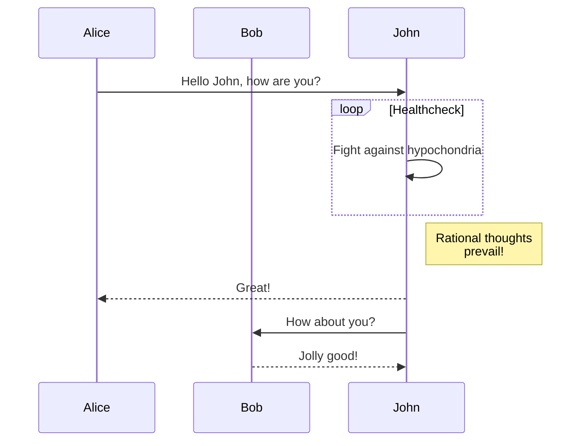
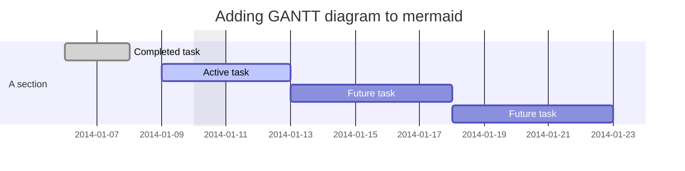
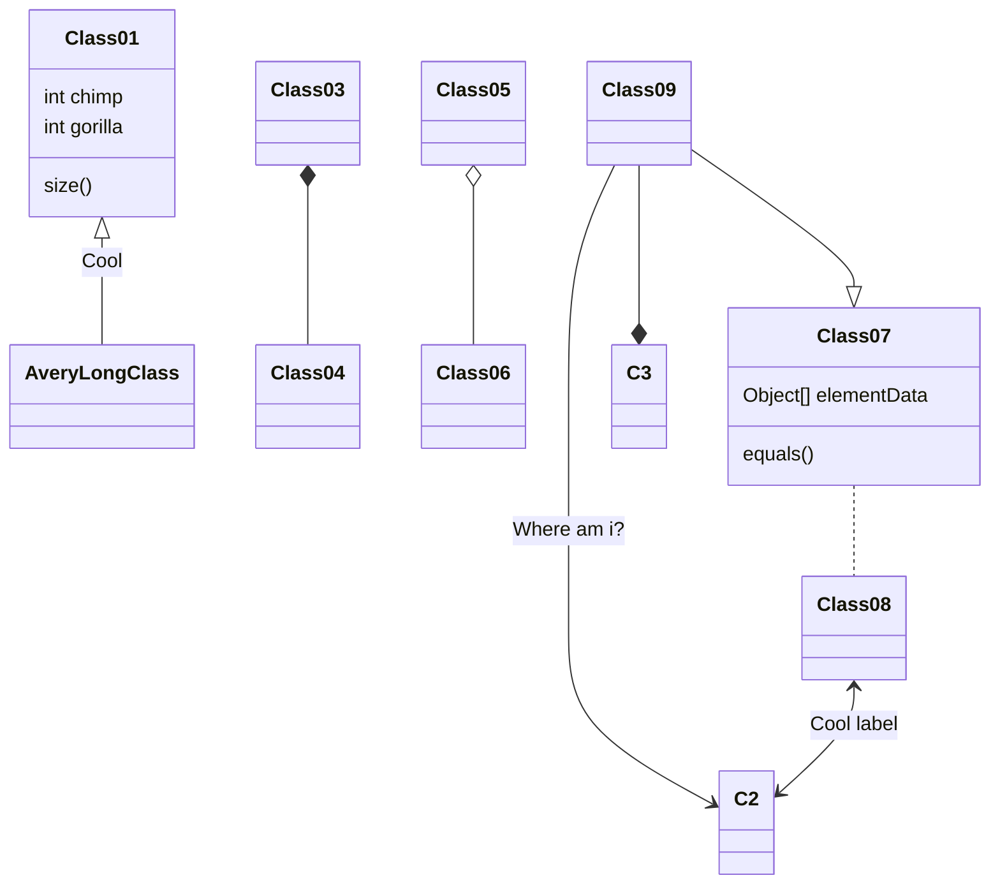
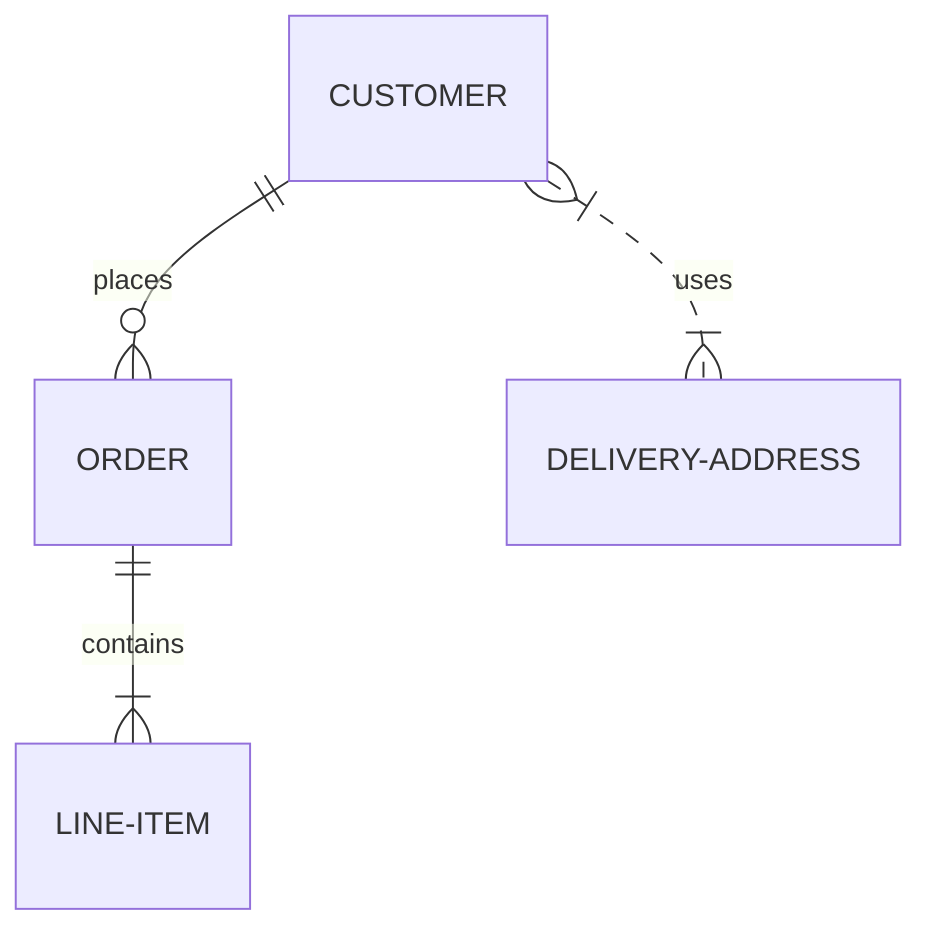

# mermaid

### <font color="#7A5FFF">图表类型</font>

#### <font color="#DF8400">流程图：流程图是由结点，几何形状和边缘、箭头或线条组成</font>

```javascript
graph TD
	A-->B;
	A-->C;
	B-->D;
	C-->D;
```


- ##### <font color="#0091FF">结点（默认）</font>

  ```javascript
  flowchart LR
  	id
  ```

  ```mermaid
  flowchart LR
  	id
  ```

- ##### <font color="#0091FF">带文本的结点</font>

  ```javascript
  flowchart LR
  	id1[This is the text in the box]
  ```

  ```mermaid
  flowchart LR
  	id1[This is the text in the box]
  ```

- ##### <font color="#0091FF">图形</font>

  - 流程图方向
    - TD 或 TB：从上到下
    - BT：从下到上
    - LR：从左到右
    - RL：从右到左

  ```javascript
  flowchart TD
  	Strat-->Stop
  ```

  ```mermaid
  flowchart TD
  	Strat-->Stop
  ```

- ##### <font color="#0091FF">结点形状</font>

  - 圆边的结点 `id( ) `
  - 椭圆形的结点 `id([ ])`
  - 子程序形状的结点 `id[[ ]]`
  - 圆柱形状的结点 `id[( )]`
  - 圆形结点 `id(( ))`
  - 不对称结点 `id> ]`
  - 菱形结点 `id{ }`
  - 六边形结点 `id{{ }}`
  - 平行四边形结点 `id[/ /]` `id[\ \]`
  - 梯形结点 `id[/\]` `id[\/]`

  ```mermaid
  flowchart TB
  	id1(圆边的结点)
  	id2([椭圆形的结点])
  	id3[[子程序形状的结点]]
  	id4[(圆柱形状的结点)]
  ```

  ```mermaid
  flowchart TB
  	id5((圆形结点))
  	id6>不对称结点]
  	id7{菱形结点}
  	id8{{六边形结点}}
  ```

  ```mermaid
  flowchart TB
  	id9[/平行四边形结点/]
  	id10[\平行四边形结点\]
  	id11[/梯形结点\]
  	id12[\梯形结点/]
  ```

- ##### <font color="#0091FF">结点之间的连接</font>

  - 带箭头的连接 `A-->B` `A--oB` `A--xB`
  - 开放的连接 `A---B`
  - 带文本的连接 `A--text---B` `A---|text|B`
  - 虚线连接 `A-.->B`
  - 加粗连接 `A==>B`
  - 双向箭头 `A<-->B`

  ```mermaid
  flowchart TB
  	A-->B
  	K--oL
  	M--xN
  	C---D
  	E-- This is the text! ---F
  	G-.->H
  	I==>J
  	O<-->P
  ```

  - 连接链
    - `A-->B-->C`
    - `A-->B & C-->D`
    - `A & B-->C & D`

  ```mermaid
  flowchart TB
  	A-->B-->C
  	D-->E & F-->G
  	H & I --> J & K
  ```

  > 可以在连接中添加额外的 - 来增加连接的长度
  >
  > 将文本内容放在引号里来避免不必要的麻烦

- ##### <font color="#0091FF">子图</font>

  ```javascript
  subgraph id [title]
  	graph definition
  end
  ```

  - 使用子图 id 建立子图之间的连接
  - 使用 direction 来设置子图的方向

  ```mermaid
  flowchart TB
  	c1-->a2
  	subgraph id1 [one]
  		a1-->a2
  	end
  	subgraph two
  		b1-->b2
  	end
  	subgraph three
  		c1-->c2
  	end
  	id1-->two
  	three-->two
  	two-->c2
  ```

  ```mermaid
  flowchart LR
  subgraph TOP
      direction LR
      subgraph B1
          direction RL
          i1-->f1
      end
      subgraph B2
          direction BT
          i2-->f2
      end
  end
  A-->TOP-->B
  B1-->B2
  ```

- ##### <font color="#0091FF">样式</font>

  - 结点样式

  ```mermaid
  flowchart LR
  	id1(Start)-->id2(Stop)
  	style id1 fill: #f9f,stroke:#333,storke-width:4px
  	style id2 fill: #bbf,stroke:#f66,storke-width:4px,color:#fff,stroke-dasharray: 5 5
  ```

  - 类：定义一个样式类，并附加到节点上
    - 定义类：`classDef className fill:#f9f;`
    - 将类附加到节点上：`class nodeId1,nodeId2 className;`
    - 使用`A:::className`操作符将类附加到节点上
    - 被命名为 default 的类被分配给所有没有特定类定义的类

  ```mermaid
  flowchart LR
  	A:::someclass-->B
  	classDef someclass fill:#f96;
  ```

  

#### <font color="#DF8400">时序图：是一种交互图，它显示了进程如何相互操作以及以什么顺序操作</font>

```javascript
sequenceDiagram
	participant Alice
	participant Bob
	Alice->>John: Hello John, how are you?
	loop Healthcheck
		John->>John: Fight against hypochondria
	end
	Note right of John: Rational thoughts <br/> prevail!
	John-->>Alice: Great!
	John->>Bob: How about you?
	Bob-->>John: Jolly good!
```




#### <font color="#DF8400">甘特图</font>

```javascript
gantt
dateFormat YYYY-MM-DD
title Adding GANTT diagram to mermaid
excludes weekdays 2014-01-10

section A section
Completed task     	:done, 	des1, 2014-01-06, 2014-01-08
Active task			:active,des2, 2014-01-09, 3d
Future task			:		des3, after des2, 5d
Future task			:		des4, after des3, 5d
```




#### <font color="#DF8400">UML 类图</font>

```javascript
classDiagram
Class01 <|-- AveryLongClass : Cool
Class03 *-- Class04
Class05 o-- Class06
Class07 .. Class08
Class09 --> C2 : Where am i?
Class09 --* C3
Class09 --|> Class07
Class07 : equals()
Class07 : Object[] elementData
Class01: size()
Class01: int chimp
Class01: int gorilla
Class08 <--> C2: Cool label
```




#### <font color="#DF8400">实体关系图</font>

```javascript
erDiagram
	CUSTOMER ||--O{ ORDER : places
	ORDER ||--|{ LINE-ITEM : contains
	CUSTOMER }|..|{ DELIVERY-ADDRESS : uses
```




