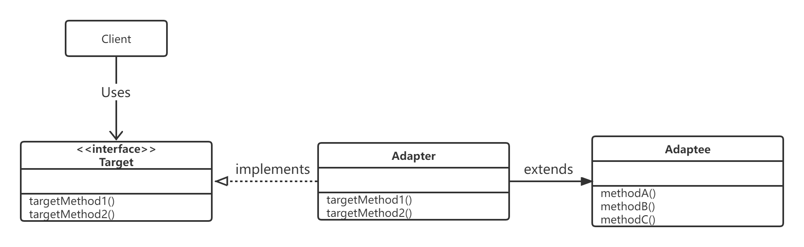
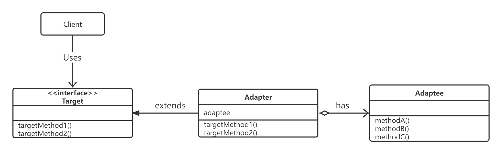
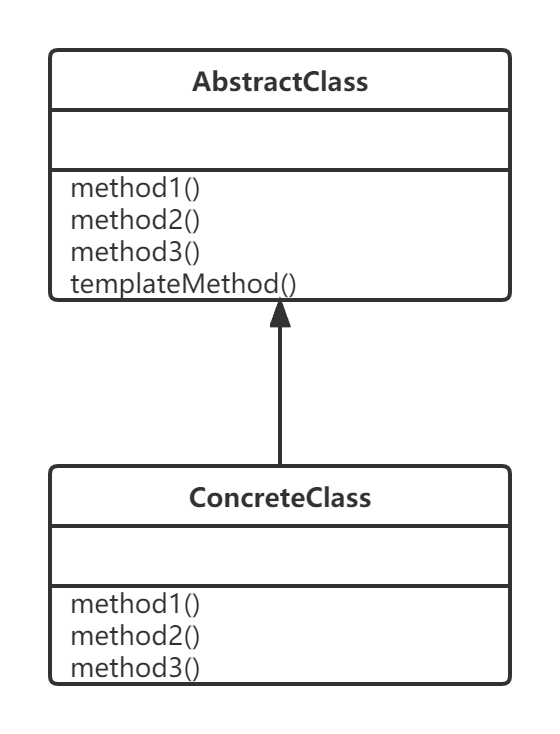
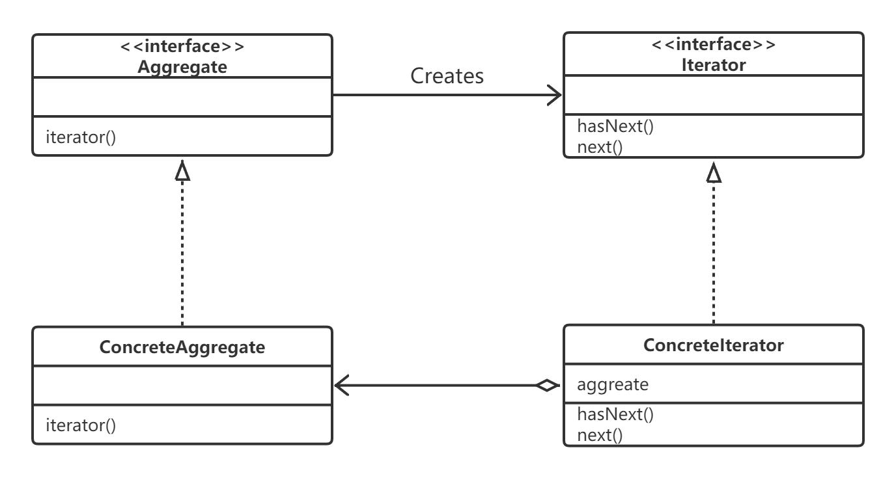

# 设计模式

## 一、设计模式七大原则

### 1.设计模式的目的

- 代码重用性
- 可读性
- 可扩展性
- 可靠性
- 使程序高内聚，低耦合

### 2.设计模式七大原则

#### （1）单一职责原则

- **一个类应该只负责一项职责**

#### （2）接口隔离原则

- 客户端不应该依赖他不需要的接口，即**一个类对另一个类的依赖应该建立在最小接口上**

#### （3）依赖倒转原则

- 高层模块不应该依赖低层模块，二者都应该依赖其抽象
- 抽象不应该依赖细节，细节应该依赖抽象
- 依赖倒转的中心思想是**面向接口编程**

#### （4）里氏替换原则

- 所有引用基类的地方必须能透明地使用其子类对象
- **子类尽量不要重写父类的方法**
- 在适当情况下，可以通过**聚合，组合，依赖**来解决问题

#### （5）开闭原则

- 一个软件实体如类，模块和函数应该**对扩展开放，对修改关闭**。用抽象构建框架，用实现扩展细节
- 当软件需要变化是，尽量**通过扩展软**件实体的行为来实现变化，而**不是通过修改**已有的代码来实现变化

#### （6）迪米特法则

- 一个对象应该对其他对象保持最少的了解
- 又叫**最少知道原则**，即一个对象**对自己依赖的类知道的越少越好**
- 只与直接朋友通信
- 直接朋友：出现**成员变量，方法参数，方法返回值**中的类称为直接朋友，而出现在**局部变量中的类不是直接朋友**。陌生类最好不要以局部变量的形式出现在类的内部。

#### （7）合成复用原则

- 尽量使用**合成/聚合**的方式，而不是使用继承

### 3.设计原则核心思想

- 找出应用中可能需要变化之处，把他们独立出来，不要和哪些不需要变化的代码混在一起
- 针对接口编程，而不是针对实现编程
- 为了交互对象之间的松耦合设计而努力

---


## 二、23中设计模式

### 1.创建型模式：

#### （1）单例模式

> 采取一定的方法保证整个软件系统中，对某个类只能存在一个对象实例，并且该类只提供一个取得其对象实例的方法（静态方法）

- ##### 饿汉式（静态常量）

  ```java
  public class Singleton {
      // 1.私有化构造器
      private Singleton() {}
  
      // 2.本类内部创建静态实例对象
      private static final Singleton instance = new Singleton();
  
      // 3.提供公共静态方法，返回对象实例
      public static Singleton getInstance() {
          return instance;
      }
  }
  ```


- ##### 饿汉式（静态代码块）

  ```java
  public class Singleton {
      private static Singleton instance;
  
      private Singleton() {}
  
      // 在静态代码块中创建对象实例
      static {
          instance = new Singleton();
      }
  
      public static Singleton getInstance() {
          return instance;
      }
  }
  ```


- ##### 懒汉式（线程不安全）==（不能使用）==

  ```java
  public class Singleton {
      private static  Singleton instance;
  
      private Singleton() {}
  
      // 提供一个共有静态方法，当调用该方法时，才去创建 instance 实例
      public static Singleton getInstance(){
          if (instance == null) {
              instance = new Singleton();
          }
          return instance;
      }
  }
  ```


- ##### 懒汉式（线程安全，同步方法）==（效率低，不推荐使用）==

  ```java
  public class Singleton {
      private static Singleton instance;
  
      private Singleton() {}
  
      // 加入同步方法
      public synchronized static Singleton getInstance(){
          if (instance == null) {
              instance = new Singleton();
          }
          return instance;
      }
  }
  ```


- ##### 懒汉式（线程安全，同步代码块）：但不能起到线程同步作用==（不能使用）==

  ```java
  public class Singleton {
      private static Singleton instance;
  
      private Singleton() {}
  
      public static Singleton getInstance() {
          if (instance == null) {
              synchronized (Singleton.class) {
                  instance = new Singleton();
              }
          }
          return instance;
      }
  }
  
  ```


- ##### 双重检查==（推荐使用）==

  ```java
  public class Singleton {
      private static Singleton instance;
  
      private Singleton() {}
  
      // 解决线程安全问题，同时解决懒加载问题
      public static Singleton getInstance() {
          if (instance == null) {
              synchronized (Singleton.class) {
                  if (instance == null) {
                      instance = new Singleton();
                  }
              }
          }
          return instance;
      }
  }
  ```


- ##### 静态内部类==（推荐使用）==

  ```java
  public class Singleton {
      private Singleton() {}
  
      private static class SingletonInstance{
          private static final Singleton INSTANCE = new Singleton();
      }
  
      public static Singleton getInstance() {
          return SingletonInstance.INSTANCE;
      }
  }	
  ```


- ##### 枚举==（推荐使用）==

  ```java
  public enum Singleton {
      INSTANCE;
  }
  ```


#### （2）工厂模式


#### （3）抽象工厂模式

 

#### （4）原型模式

#### （5）建造者模式

### 2.结构型模式：

#### （1）适配器模式

> 在程序中，会存在现有的程序无法直接使用，需要做适当的变换之后才能使用。Adapter 模式就用于填补“现有的程序”和所需的程序之间差异

##### 类适配器模式（使用继承的适配器）



##### 对象适配器模式（使用委托的适配器）



##### 接口适配器模式

- **Target（对象）**
  - 负责定义所需方法
- **Client（请求者）**
  - 负责使用 Target 角色所定义的方法进行具体处理
- **Adaptee（被适配）**
  - 持有特定方法的角色
- **Adapter（适配）**
  - 使用 Adaptee 角色的方法来满足 Target 角色的需求

#### （2）桥接模式

#### （3）装饰模式

> **动态的将新功能附加到对象上**

#### （4）组合模式

#### （5）外观模式

#### （6）享元模式

#### （7）代理模式

### 3.行为性模式

#### （1）模板方法模式

> - Template Method 模式是带有模板功能的模式，组成模板的方法被定义在父类中。这些方法是抽象方法，在父类中无法知道这些方法进行何种具体处理，只能知道父类如何调用这些方法
>
> - 实现上述这些抽象方法的是子类，子类中实现了抽象方法
> - 在父类中定义处理流程的框架，在子类中实现具体处理的模式称为 Template Method 模式



- **AbstractClass（抽象类）**
  - AbstractClass 不仅负责实现模板方法，还负责声明在模板方法中所使用的抽象方法。这些抽象方法由子类 ConcreteClass 角色负责实现
- **ConcreteClass（具体类）**
  - 负责实现 AbstractClass 角色中定义的抽象方法。这里实现的方法将会在 AbstractClass 角色的模板方法中被调用

#### （2）命令模式

#### （3）访问者模式

#### （4）迭代器模式

> Iterator 模式用于在数据集合中按照顺序遍历集合



- **Iterator（迭代器）**
- 定义按顺序逐个遍历元素的接口
  
- `hasNext` 方法用于判断是否存在下一个元素
  
- `next` 方法用于获取该元素


- **ConcreteIterator（具体的迭代器）**
  - 实现 Iterator 所定义的接口


- **Aggregate（集合）**
  - 定义创建 Iterator 角色的接口


- **ConcreteAggregate（具体的集合）**
  - 实现 Aggregate 角色所定义的接口，创建具体的 Iterator 角色，即 ConcreteIterator


#### （5）观察者模式

#### （6）中介者模式

#### （7）备忘录模式

#### （8）解释器模式

#### （9）状态模式

#### （10）策略模式

#### （11）责任链模式
